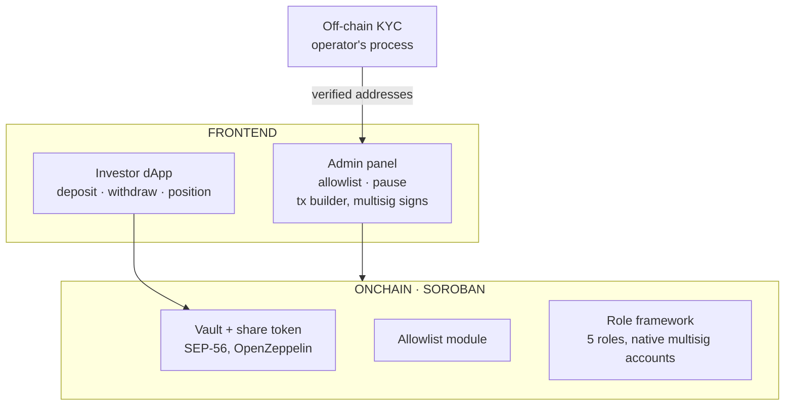

# Strata Vault Kit — Technical Architecture

_White-label, compliance-gated vault infrastructure on Stellar/Soroban._

This document specifies what ships in the current milestone. The product's
direction — vaults whose capital deploys off-chain with value reported back
on-chain — is stated in §11 and specified when it is designed, not before.

## 1. Overview

An allowlisted investor deposits USDC on Stellar into a vault contract and
receives shares; returning the shares recovers the USDC. Two rules define the
product: **only verified addresses may enter**, and **exits are always open** —
a de-listed holder can always leave. There is no yield in this milestone:
`total_assets` is the contract's USDC balance, so the share price is effectively
1:1.

Every team building a compliance-gated vault on Stellar assembles the same
pieces. OpenZeppelin's Soroban library provides the audited fraction — token,
vault math, access control, pausable, upgradeable — and each team wires gating,
roles, deployment and operations around it. Strata Vault Kit is that assembly,
packaged as a template: **a team sets parameters and authorities and deploys.
Configured, not built.**

## 2. Design principles

1. **Nothing money-critical is hand-rolled.** Share accounting, conversion math,
   rounding: 100% OpenZeppelin, pinned to audited releases. The custom layer is
   gating and wiring — it composes around the primitives, never rewrites them.
2. **Exits are always open.** `withdraw`/`redeem` are never gated nor pausable.
   The vault never traps funds; the exit asset (USDC) carries its own
   compliance.
3. **Separation of duties by construction.** Compliance gates addresses but
   touches nothing else; the guardian can pause entries but cannot change code;
   governance assigns authority but acts through a timelocked, multisig path.
4. **Upstream-first.** Gaps found in OpenZeppelin primitives are reported and
   contributed upstream; local workarounds carry an explicit deletion trigger.
   Nothing in the product waits on upstream.

## 3. System architecture



The frontend is backend-free: the dApp and admin panel read contract state over
RPC and build transactions that the authority multisigs sign. KYC itself happens
wherever the operator runs it; the chain only sees its output — an address added
by the compliance authority.

## 4. Vault and share token

One contract: the vault **is** the share token (SEP-56 tokenized-vault standard,
OpenZeppelin implementation). Mint/burn is bound to deposits and withdrawals —
no discretionary issuance path. Appreciating-share model by construction
(balances constant, value-per-share moves), although in this milestone
value-per-share stays 1:1.

```
shares_minted   = deposit * total_shares / total_assets
assets_returned = shares_burned * total_assets / total_shares
```

Composition detail that matters for auditability: compliance gating does not
fork or modify OpenZeppelin's vault. The OZ `AllowList` storage module is
reused, with checks placed in the entrypoint overrides, keeping the storage
layout upstream-compatible. A known upstream limitation (mutual exclusivity of
OZ contract types) makes this the correct composition today; when the upstream
fix ships in an audited release, the manual checks are deleted.

## 5. Compliance module

A set of KYC-verified addresses maintained by the compliance authority.
`deposit`/`mint` check the receiver; two transfer modes are configurable at
deploy: **disabled** (shares non-transferable) or **both-sides-allowlisted**
(secondary movement only between verified parties). `withdraw`/`redeem` are
never checked — principle 2.

## 6. Roles and separation of duties

Five roles, assignable at deploy time (one account may hold several). Each
authority is a native Stellar multisig account; the contract requires the
account's authorization — no multisig code on-chain.

| Role        | In this milestone                       |
| ----------- | --------------------------------------- |
| Governance  | Assigns roles, authorizes upgrades      |
| Compliance  | Maintains the allowlist                 |
| Guardian    | Pauses deposits/transfers — never exits |
| Attestation | Declared and assigned; no functions yet |
| Treasury    | Declared and assigned; no functions yet |

The last two exist now so their storage and authority wiring don't force a
redeploy when their modules ship. Governance tooling is not rebuilt: role
management runs on OpenZeppelin's open-source Role Manager, with role-change
history served by OZ's public indexers.

## 7. Investor flow

1. **Onboard** — KYC with the operator, address allowlisted.
2. **Deposit** — USDC in, shares minted.
3. **Withdraw** — shares burned, USDC out. Works even after de-listing; pause
   never blocks it.

## 8. Deployment and configurability

Template repository, deploy-time configuration, independent instances — no
factory, no shared state between deployments. The configuration struct is
**versioned from day one** (`ConfigV1` with a migration path), because an
upgradeable contract plus an unversioned config struct is a storage-migration
trap.

| Parameter       | Meaning                                                      |
| --------------- | ------------------------------------------------------------ |
| Token metadata  | Name, symbol of the share token                              |
| Authorities     | The five role addresses (multisigs)                          |
| Transfer mode   | `disabled` / `both-sides-allowlisted`                        |
| Decimals offset | Share-price scaling mitigating the ERC-4626 inflation attack |

Deployment is reproducible from a fresh clone: scripts create the multisig
accounts, deploy, and assign roles end-to-end.

## 9. Security and trust model

**On-chain controls:** audited OZ releases only, exact version pins; guardian
pause that can never trap exits; governance-gated upgrades; storage TTL
discipline (Soroban state expires and must be extended — no vault entry may
silently archive); role authorization via direct checks, never role enumeration
in contract logic (avoiding a known upstream concurrency issue).

**Known upstream limitations, handled:** the OZ contract-type system prevents
composing the vault and allowlist types directly (worked around as described in
§4, with a deletion trigger), and the vault's conversion math does not yet honor
custom `total_assets` overrides — reported upstream with a contribution offered;
relevant to future modules, not to this milestone.

**Trust assumptions, disclosed:** the accuracy of the operator's KYC process,
and the operator's key ceremony for the multisig authorities. The template
constrains what reaches the chain; it does not verify the world.

## 10. Ecosystem

OpenZeppelin Role Manager (governance UI and role history, zero custom code) and
Scaffold Stellar (typed TS clients, deploy configuration) are used today.
Further composability — oracles, yield distribution, cross-chain inflows — is
deliberately deferred until the modules that justify it exist.

## 11. Direction

The archetype this template is built toward: capital that leaves the chain into
a real-world structure, with value reported back under on-chain constraints and
redemptions that respect real-world timelines. Those modules — valuation and
notice-period redemptions — are the next milestone, and this document will
specify them when they are designed.

## 12. What it is not

- No yield in this milestone: share price is 1:1 until the valuation module
  ships. The README says so explicitly.
- Not a vault for tokenized RWA tokens held and allocated on-chain — this
  template targets capital that leaves the chain.
- Not a custody or legal solution — KYC, key ceremonies, and the real-world
  structure are the operator's.
- Testnet only. Mainnet requires an external audit and an audited OpenZeppelin
  release covering every module used.
