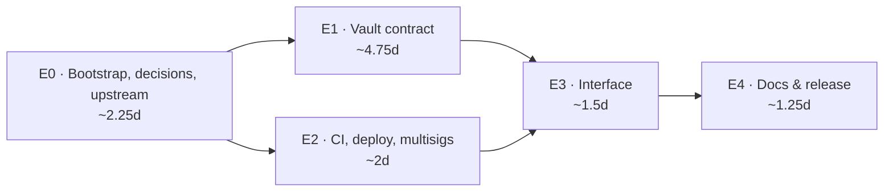

# Technical Roadmap — Milestone 1

## Where we start

This repo is empty. The contract is built here, capability by capability.

[`stellar-vault-demo-dapp`](https://github.com/BootNodeDev/stellar-vault-demo-dapp) is
our own working testnet demo and serves as a **reference**: an OZ Vault composed with
AllowList as a storage module, gating on `transfer`/`transfer_from` (both sides) and
`deposit`/`mint` (receiver), open exits, LP counter, instance TTL discipline (Soroban
storage expires and must be extended — ["state archival"](https://developers.stellar.org/docs/learn/fundamentals/contract-development/storage/state-archival)),
native 2-of-3 multisig, backend-free signing harness, Playwright e2e. Its contract is
188 lines. Read it while building; do not port it wholesale.

Its frontend is **not** carried over. M1 builds a new interface designed around the role
model, pause states and white-label configuration.

**Versions:** OZ [`=0.7.2`](https://crates.io/crates/stellar-tokens) (latest; the 0.7.x
line has a published audit of v0.7.0) · [soroban-sdk](https://crates.io/crates/soroban-sdk)
`=26.1.0` (do **not** upgrade to 27.x — K4) · Rust 1.93 / wasm32v1-none.

## Decisions

1. **Composition:** `ContractType = Vault` intact + OZ `AllowList` as a storage module
   (never occupying the type slot), with checks in the `transfer`/`transfer_from`/
   `deposit`/`mint` overrides. Share math stays 100% OZ. Alternatives (RWA share token +
   custom vault logic, or a two-contract split) are rejected for M1: both rewrite
   money-critical conversion math.
2. **Exits-open:** `withdraw`/`redeem` are never gated nor pausable — a de-listed holder
   can always leave. The withdraw `receiver` isn't gated either (USDC carries its own
   compliance).
3. **Roles:** AccessControl (`stellar-access`), five roles as `Symbol`s. `symbol_short!`
   caps at 9 chars — `governance`, `compliance`, `attestation` don't fit; final naming
   (shorten vs. runtime `Symbol::new`) is closed in #8. Only compliance and guardian get
   entrypoints in M1; the other two are declared now to avoid a redeploy in M2.
   Governance UI is OZ Role Manager — we don't build one. There is no `Ownable` phase:
   AccessControl arrives with the first thing worth gating.
4. **Authorities:** native Stellar multisig G-accounts as tx source.
5. **Versions policy:** exact pins; upgrades are never done mid-milestone — each
   migration is its own issue in the following milestone.
6. **Upstream policy:** gaps in OZ primitives get a comment/PR upstream with this repo as
   evidence, plus a local workaround marked
   `// WORKAROUND(OZ#nnn): <what> — delete when <trigger>` (greppable; a workaround
   without this comment is a process bug). **Upstream never sits on the critical path.**
7. **Context files:** `AGENTS.md` is the source of truth for build, run and gotchas;
   `CLAUDE.md` is a pointer to it. Versions, decisions and known issues live in this
   document and are not restated anywhere else.

## Known issues — OZ primitives (=0.7.2)

| # | Issue | Impact | Handling | Action trigger |
|---|---|---|---|---|
| K1 | [#560](https://github.com/OpenZeppelin/stellar-contracts/issues/560): `ContractType` mutual exclusivity — `Vault` and `AllowList` can't compose as types. Two fix approaches exist upstream (PR #821 `Compose`, PR #561 negative trait bounds) and their open/closed states have flipped during our own tracking — do not cite either as "the active one" | Solved in our code via Decision 1 | Keep the manual checks; storage layout is OZ's. Watch the **issue** only | #560 fix in an **audited release** → migrate, delete manual overrides, next milestone |
| K2 | [#674](https://github.com/OpenZeppelin/stellar-contracts/issues/674): internal conversion math ignores `total_assets` overrides | Zero in M1 (default = contract balance is what we want). **Blocks attested-NAV accounting in M2** | Upstream comment + PR offer (#9). Rewriting conversion math ourselves is prohibited without a formal decision | Upstream fix → adopt. If M2 starts without it → decide fork-minimal vs. wait on day 1 of M2 |
| K3 | [#752](https://github.com/OpenZeppelin/stellar-contracts/issues/752): role enumeration uses counter-derived storage keys → **footprint invalidation under concurrency** | Concurrent role-admin transactions can fail (not just cosmetic listings) | Never use enumeration in contract logic (`has_role` only); run role-admin ops sequentially | Upstream fix; no action ours |
| K4 | soroban-sdk 27.0.5 (2026-08-03) is incompatible with OZ 0.7.2 (coupled to sdk 26) | Upgrading breaks the build | Stay on 26.x; dependabot ignore rule for sdk majors (#14) | Compatible OZ release → migration as its own issue, next milestone |
| K5 | SEP-56 / SEP-57 are Draft status | Interface may move before mainnet | Accepted on testnet; frozen against the pinned version | Re-verify pre-mainnet; mainnet only on an audited OZ release covering the Vault module |
| K6 | The hosted OZ Role Manager has mainnet disabled | None in M1 (testnet only) | Self-hosting Role Manager is a mainnet-track task | Mainnet planning |

## Sequence

## E0 — Bootstrap, decisions and upstream (≈2.25 d) · epic [#1](https://github.com/BootNodeDev/open-rwa-vault/issues/1)

| Issue | Title | Est. |
|---|---|---|
| [#6](https://github.com/BootNodeDev/open-rwa-vault/issues/6) | Bootstrap the product repo | 1 |
| [#7](https://github.com/BootNodeDev/open-rwa-vault/issues/7) | Does Role Manager detect a stellar-access contract? | 0.5 |
| [#8](https://github.com/BootNodeDev/open-rwa-vault/issues/8) | Close the open design questions and record ADRs | 0.25 |
| [#9](https://github.com/BootNodeDev/open-rwa-vault/issues/9) | Report two OpenZeppelin primitive gaps upstream | 0.5 |

**Notes**

- **#6** — workspace skeleton, context files, milestone docs, starter-kit templates. No
  contract, no frontend. Blocks everything except #7.
- **#7** — the milestone's only stop-gate, on a toy contract, **unblocked and run on day
  one in parallel with #6**. A no here revisits Decision 3 for pennies instead of
  mid-#21.
- **#8** — four questions: (a) does `deposit` gate the receiver only, or both sides;
  (b) is the LP counter a product feature or a reference-base leftover (if it survives,
  it becomes an issue); (c) role naming under the 9-char limit; (d) licence — the
  reference base ships BUSL-1.1 and SCF may require Apache-2.0.

## E1 — Vault contract (≈4.75 d) · epic [#2](https://github.com/BootNodeDev/open-rwa-vault/issues/2)

Built capability by capability, each its own PR with tests.

| Issue | Title | Est. |
|---|---|---|
| [#20](https://github.com/BootNodeDev/open-rwa-vault/issues/20) | Build the vault on the OpenZeppelin Soroban vault | 1 |
| [#21](https://github.com/BootNodeDev/open-rwa-vault/issues/21) | Gate entry with an allowlist and keep exits open | 1.25 |
| [#22](https://github.com/BootNodeDev/open-rwa-vault/issues/22) | Gate share transfers on both sides | 0.5 |
| [#23](https://github.com/BootNodeDev/open-rwa-vault/issues/23) | Pause entries without ever blocking exits | 0.5 |
| [#24](https://github.com/BootNodeDev/open-rwa-vault/issues/24) | Make the contract upgradeable under governance | 0.75 |
| [#25](https://github.com/BootNodeDev/open-rwa-vault/issues/25) | Configure the vault at deploy time | 0.75 |

**Notes**

- **#20** establishes the baseline with no access control, so **#21** lands Decision 1 as
  a reviewable diff rather than burying it.
- **#21** introduces `#[only_role(caller, "...")]`, which adds a `caller: Address`
  parameter to every gated entrypoint. Public signatures change, and the generated TS
  clients are an input to #16.
- **#24 and #25 are coupled.** The Upgradeable docs warn that reading old storage with a
  changed type traps and the old type must stay defined in the new code — so #25's config
  is `ConfigV1` with an `into_latest` path from day one.
- No role enumeration in contract logic (K3).

## E2 — CI, deploy and multisigs (≈2 d) · epic [#3](https://github.com/BootNodeDev/open-rwa-vault/issues/3) — parallel to E1

| Issue | Title | Est. |
|---|---|---|
| [#14](https://github.com/BootNodeDev/open-rwa-vault/issues/14) | Set up continuous integration for the contracts | 1 |
| [#15](https://github.com/BootNodeDev/open-rwa-vault/issues/15) | Deploy reproducibly with the four multisigs | 1 |

**Notes**

- **#14** — contracts pipeline only; the frontend pipeline arrives with the frontend. The
  reference base has no workflows and its dependabot config covers only npm, so the
  `cargo` ecosystem has to be added before a `soroban-sdk` ignore rule applies to
  anything.
- **#15** — the reference `environments.toml` passes only `--asset` while the constructor
  also takes an admin, so a clean redeploy fails there today.

## E3 — Interface (≈1.5 d) · epic [#4](https://github.com/BootNodeDev/open-rwa-vault/issues/4)

| Issue | Title | Est. |
|---|---|---|
| [#16](https://github.com/BootNodeDev/open-rwa-vault/issues/16) | Build a role-aware admin surface | 1 |
| [#17](https://github.com/BootNodeDev/open-rwa-vault/issues/17) | Show pause state and read branding from config | 0.5 |

**Notes**

- New interface, not a port. The reference UI was built for a single owner and informs
  the design without supplying the code.
- **#16** consumes the entrypoint signatures frozen in #21 and the deployment from #15.
  Roles are read with `has_role`, never enumerated.

## E4 — Documentation and release (≈1.25 d) · epic [#5](https://github.com/BootNodeDev/open-rwa-vault/issues/5)

| Issue | Title | Est. |
|---|---|---|
| [#18](https://github.com/BootNodeDev/open-rwa-vault/issues/18) | Write the README, architecture and operator runbook | 0.75 |
| [#19](https://github.com/BootNodeDev/open-rwa-vault/issues/19) | Run the Definition of Done and tag the release | 0.5 |

**Notes**

- `architecture.md` is written here, not at bootstrap: the architecture moves throughout
  E1.
- The Definition of Done is executed by whoever did **not** write each part, following
  only the docs. If they get stuck, the defect is in the documentation.

## Definition of Done

- From a fresh clone: full testnet deploy following the README, with the 4 multisig
  authorities operational.
- E2E demo: allowlist add → deposit → withdraw → allowlist remove → deposit reverts,
  **withdraw still works**.
- Transfer behaves per configured mode (both modes tested); `transfer_from` gated and
  tested.
- Pause blocks deposit/mint/transfer, never withdraw/redeem; unpause restores.
- CI green; Role Manager runbook verified by cross-execution.
- Comments published on OZ #560 and #674; ADRs and addresses in the repo.
- Tag `v0.1.0-m1`.

## Totals

| | Estimate |
|---|---|
| Happy-path effort | ~11.75 person-days |
| Contingency (35%) | ~4.1 person-days |
| **Total effort** | **~15.9 person-days** |
| **Target calendar** | **~2 weeks** (E1 ∥ E2 parallelize) |

Estimates are maintained in the `Estimate` field of the
[project board](https://github.com/orgs/BootNodeDev/projects/29), which is what sums.
The table above is a snapshot.

## Out of scope

- Request-withdraw / notice period / attestation / oracle / indexer: M2+.
- Porting the reference frontend.
- Any upstream fix landing mid-M1 (#674, #560): record the trigger in K1/K2, migrate next
  milestone — never hot-swap.
