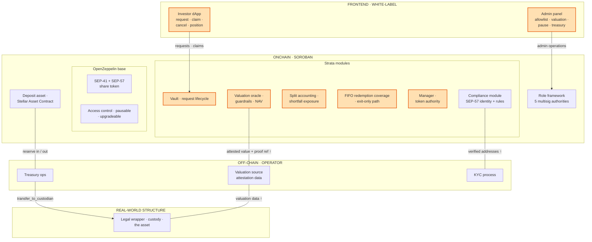
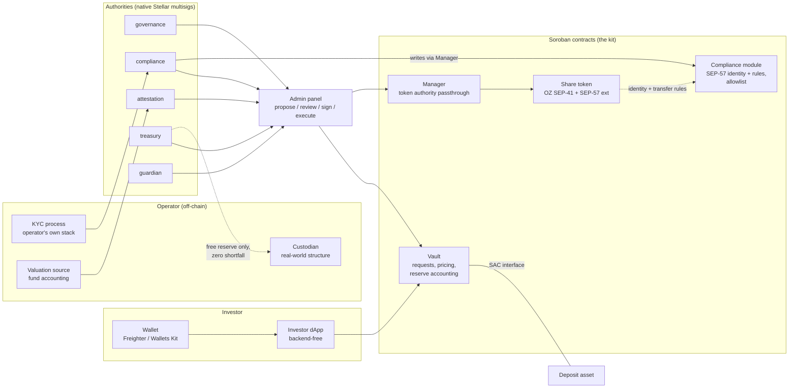
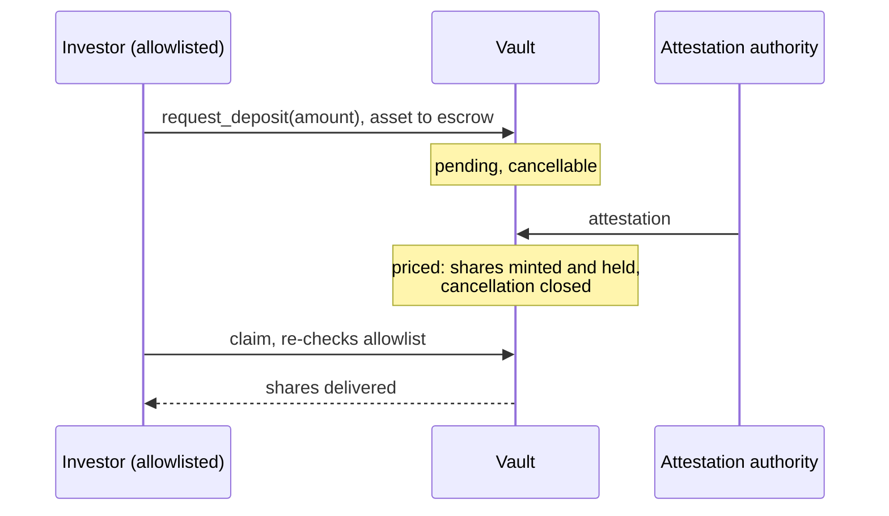
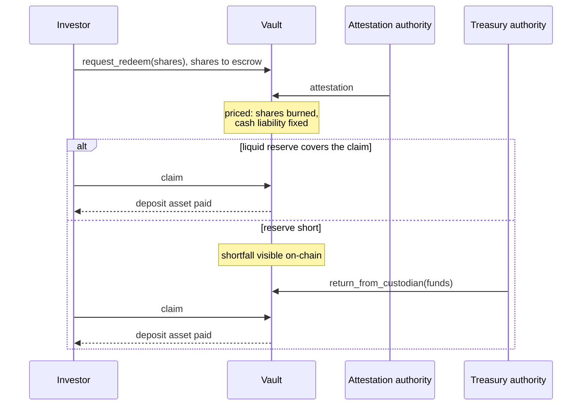

# Strata: Product and Architecture

## 1. What it is

Strata is an open-source vault kit on Stellar for teams whose capital works
off-chain: they raise funds on-chain, deploy it into a real-world structure, and
attest value back. Because no live market prices the asset, subscriptions and
redemptions are requests, priced against on-chain guarded attestations. Built on
OpenZeppelin's Stellar contracts and distributed as a kit: each operator
deploys, configures and brands an independent white-label instance, setting
roughly ten parameters and five authorities.

Shares in this vault are a claim on an off-chain asset whose value is attested
on chain. No price exists at the moment you act, so entry and exit are requests:
what you put in goes into escrow, the next accepted attestation prices it, and
you claim the result.

## 2. Problem

Every team tokenizing an off-chain asset builds the same vault: attested
valuation, reserve accounting, request-based subscriptions and redemptions,
separation of duties, and the mechanics to operate it. None of it is their
business, and all of it is trust-critical.

Because each implementation is private and one-off, the work never compounds: no
shared best practices, audits that start from zero every time, quality bounded
by one team's review. One open-source project solving exactly this inverts that:
one codebase hardened by every adopter, one audit surface, and each team's
effort going into its asset and its business.

## 3. Why these vaults are asynchronous

The vault does not hold the asset. The capital works off-chain, in things like
insurance treaties, bonds, or a vineyard's production, which take administrative
work to enter and exit and are not always liquid. Redemptions therefore cannot
be instant: they start with a request and settle later, when the position can
actually be unwound.

Pricing is asynchronous for the same reason. Since the asset is off-chain, the
contract cannot compute its value; someone accountable reports it, and the share
price derives from that attested NAV, published periodically rather than at the
moment of each transaction. Subscriptions and redemptions settle against a
published NAV, not against an instantaneous market price.

Finally, this is a regulated environment: shares cannot be bought freely.
Investors are vetted off-chain, and only allowlisted addresses can subscribe.

This is the shape ERC-7540 standardized on EVM: request-based deposits and
redemptions on top of the tokenized vault. Strata brings that shape to Stellar.

## 4. Solution

Strata is a vault kit: out-of-the-shelf Soroban contract modules plus
white-label frontends, built on top of existing Stellar tooling and
OpenZeppelin's contracts rather than replacing them. The contracts cover the
RWA-specific layer: a request-based vault on OpenZeppelin's token and contract
crates (SEP-41 share token with SEP-57 RWA extensions, access control, pausable,
upgradeable), a valuation oracle with on-chain guardrails, split reserve
accounting with explicit shortfall exposure, FIFO redemption coverage, and
allowlist compliance. The frontends cover operations: a white-label investor
dApp and an admin panel for the operator. Everything ships as an Apache-2.0
template with reproducible, verified deploys and a standard price feed (SEP-40),
so a team sets roughly ten parameters and five authorities, brands the frontend,
and runs its own instance.

What stays with the operator: legal entity, custody, KYC, the data behind the
attestation, and what the numbers mean. Deliberately not a custody, compliance,
or legal solution, and not a vault for on-chain RWA tokens.

## 5. Actors

| Actor | On-chain authority | Does |
|---|---|---|
| Investor (LP) | None (allowlisted address) | Requests deposits and redemptions, claims shares or cash, cancels pending requests, views position |
| Valuation reporter | attestation | Attests the share price with a proof reference, under on-chain guardrails |
| Treasury ops | treasury | Moves free reserve between the vault and the custodian |
| Compliance | compliance | Maintains the allowlist; token interventions (freeze, forced transfer, recovery) |
| Guardian | guardian | Pauses new requests, pricing and custodian transfers; can never block payable claims |
| Governance | governance | Parameters, roles, custodian rotation, upgrades behind a timelock |
| Custodian | Not an authority | Off-chain party holding the real-world structure; a genesis-configured slot rotatable only by governance |

Five authorities in code, held by native Stellar multisig accounts, assignable
at deploy; one account may hold several.

## 6. How it works

1. Compliance allowlists a verified investor.
2. The investor requests a subscription: USDC moves into escrow, cancellable
   until the epoch is sealed.
3. The reporter attests the share price. The epoch is priced, shares are minted
   at that price, and the investor claims them.
4. Treasury deploys free reserve into the real-world structure; attested value
   moves between pockets, the total does not change.
5. The investor requests a redemption: shares move into escrow, the next
   attestation prices them, and a fixed cash liability is created. Priced claims
   are never re-priced.
6. The investor claims the cash once the liquid reserve covers it, in FIFO
   order. If the reserve is short, the shortfall is visible on-chain and
   treasury tops up.

## 7. Who uses it

- An SCF-funded RWA team (reinsurance, trade finance, commodities) that wants to
  spend its grant on its business, not on vault plumbing.
- A fund or asset manager tokenizing an off-chain strategy for verified
  investors.
- An integrator or protocol consuming the vault share price through the standard
  SEP-40 feed.

## 8. Architecture

### 8.1 Design principles

1. **Configured, not built.** Each operator deploys an independent instance: no
   factory, no shared state. A deployment is defined by its configuration and
   five authorities (native Stellar multisig accounts). Everything an operator
   brands or configures lives outside the trust boundary; everything inside it
   is the same code for every adopter.

2. **Built on OpenZeppelin, differentiated above it.** The share token is OZ's
   SEP-41 token with the SEP-57 RWA extensions (freeze, forced transfer,
   recovery); access control, pausable and upgradeable come from OZ crates.
   Dependencies are pinned to exact versions and audit inheritance is evaluated
   component by component; what Strata adds stays within its own audit scope.
   What OZ does not cover is the layer Strata adds: the attested valuation
   oracle, request-based flows priced against attestations, split reserve
   accounting, and the operational surface.

3. **Request-based entry and exit.** The exact price of a share does not exist
   when an investor acts; it is attested afterwards. Entry and exit are
   requests: funds or shares go into escrow, the epoch holding them is priced
   against an attestation, and the investor claims the result. This is the
   ERC-7540 pattern with two differences: cancellation is a single step that
   closes when the epoch is sealed, and the price comes from the attestation
   valid at pricing, not from a manager.

4. **Attested NAV.** The reporter attests the share price itself, computed
   off-chain from the deployed value and the vault's public figures under a
   documented methodology. The contract validates, stores and exposes it. Every
   on-chain operation preserves that price by construction: pricing a deposit
   releases escrow into the reserve and mints shares in proportion, pricing a
   redemption burns shares and fixes the matching liability, and a custodian
   transfer moves value between pockets without changing the total.

5. **Payable claims always pay.** Neither the guardian pause, a delisting, nor a
   stale valuation can block the payment of an already-priced, funded cash
   claim. A pause can delay unpriced requests. Priced claims are never re-priced
   and never identity-gated. A delisted, non-frozen investor exits through the
   exit-only cash path. Outside this guarantee, disclosed as trust assumptions:
   a frozen investor, deposit-asset issuer controls, and reserve liquidity.

6. **Split accounting, with priced and payable as separate states.** The vault
   exposes committed (priced redemption liabilities), cancellable escrow
   (pending subscriptions the investor can still recall) and free reserve.
   Escrowed subscriptions never leave the vault. Committed can exceed the liquid
   reserve; that gap is an explicit on-chain shortfall, outbound transfers are
   blocked while it exists, and priced claims stay payable in FIFO order as
   treasury tops up. A liquidity shortfall is not insolvency: solvency compares
   total attested assets against liabilities and is handled by attested losses
   and governance.

### 8.2 Component overview

Orange marks what only Strata provides; white is the existing ecosystem the kit
consumes or integrates.



Authority and contract wiring:



Both interfaces are backend-free: they read contract state and build
transactions that the authority multisigs sign. The chain never sees KYC data or
valuation methodology, only their outputs: an allowlisted address, an attested
number with a proof reference.

### 8.3 Components and authorities

| Component | Role | Controls |
|---|---|---|
| **Vault** | Request lifecycle, pricing, split reserve accounting, custodian transfers, upgrade control | One authority per privileged entrypoint; upgrades behind a governance timelock with an exit window |
| **Share token** | OZ SEP-41 + SEP-57 RWA extensions: freeze, forced transfer, recovery, identity and compliance checks on every transfer, independent transfer pause | Token manager authority held exclusively by the Manager contract, never a human key |
| **Manager** | Token manager passthrough: every privileged token operation goes through it and is checked against roles | Role-gated |
| **Compliance module** | Implements the SEP-57 identity and rules interfaces the share token consults, with the allowlist as its only rule | Written only by the compliance authority via the Manager; replaceable by OZ's identity verifier and compliance contracts (with RWA Wizard modules) without touching the token |
| **Five authorities** | governance (parameters, roles, timelocked upgrades), compliance (allowlist, token interventions), attestation (valuation only), treasury (reserve movements only), guardian (pause; never payable claims) | Native Stellar multisig accounts; treasury and guardian distinct, compliance distinct from governance and treasury |
| **Custodian** | Off-chain party holding the real-world structure; a genesis-configured slot rotatable only by governance | Not an on-chain authority |

Each authority's threshold is sized to the quorum that authority requires.
Signing of privileged operations through a coordinator is verified end to end,
not assumed.

### 8.4 Request lifecycle

Every position change is a request with three states: **pending, priced,
claimed**. Requests join the open epoch. Sealing an epoch closes it to new
requests and opens the next; pricing it reads the oracle and fixes one share
price for every request it holds. Pricing is permissionless and refuses a feed
that is not valid, so a sealed epoch waits rather than settling at a stale
price, and no investor can choose their price.

Sealing is gated on the manager role today. It is meant to become permissionless
once a minimum epoch duration bounds it; until then, whoever seals chooses the
batch boundary, though not the price it receives.

#### Subscription

- Request: verifies the receiver is allowlisted, moves the deposit asset into
  escrow. At most one active request per controller.
- Pricing: the escrow leaves the cancellable bucket, the share quantity is set
  at the epoch's price, and the shares are minted and held for the investor.
- Cancellation: atomic, available until the epoch is sealed; returns the
  escrowed asset in full.
- Share claim: re-verifies the receiver and delivers the shares. If verification
  fails, the position remains shares and exits through the redemption lifecycle
  at the then-current price. No nominal refund exists after pricing.

#### Redemption

- Request: moves shares into escrow, no admission limit.
- Pricing: the escrowed shares are burned and a fixed cash liability enters
  committed at the epoch's price. Priced claims are never re-priced.
- Coverage: a priced claim is payable when the liquid reserve covers it, in FIFO
  order. An earlier unpaid claim never blocks a later one that is already
  covered. The gap between committed and liquid reserve is the on-chain
  shortfall treasury must top up.
- Cash claim: pays the fixed amount; it does not depend on identity. A delisted,
  non-frozen investor uses the exit-only cash path and cannot cancel back to
  shares.





### 8.5 Valuation and accounting

The NAV is a permissioned attestation of the share price, published with a proof
reference. The reporter computes it off-chain under a published methodology. The
contract checks bounds, cooldown and the deviation cap, then stores the price
and exposes it with the liquidity figures it owns:

```text
liquid_reserve = reserve - cancellable_deposit_escrow
free_reserve   = max(liquid_reserve - committed, 0)
shortfall      = max(committed - liquid_reserve, 0)
```

**Attestation guardrails:** the reporter is a multisig, never a single key. Each
attestation carries the share price and a proof reference; attestations are
ordered by their acceptance time on the ledger. The price must stay within
configured bounds, a minimum cooldown bounds frequency, and the deviation cap is
asymmetric: upside is bounded per update, downward updates are uncapped so
losses are recognized immediately.

**Freshness and pause:** each attestation opens a validity window; when it
lapses the feed is stale and new requests stop being priced. Guardian or
governance can pause the vault: new requests, pricing and custodian transfers
stop; payable claims, pending cancellations and refunds continue; attestations
that pass the guardrails are still accepted, so recovery never deadlocks. Only
governance lifts the pause, and only while the latest attestation is fresh.
Paused and stale are independent: freshness lapses on its own, the pause is a
decision.

**Integrator surface:** the oracle exposes the attested share price directly, as
the latest report with its proof reference and acceptance time. The SEP-40 feed
named in section 4 is an adapter over that surface and is not implemented yet;
integrators read the oracle's own interface today.

### 8.6 Compliance

- The share token follows the SEP-57 topology: it consults identity for every
  receiver and rules for every transfer. The kit ships one compliance module for
  both, with the allowlist as its only rule; an operator needing richer rules
  replaces it with OZ's contracts without touching the token.
- KYC happens wherever the operator runs it; the chain sees only its output. The
  compliance authority writes allowlist entries via the Manager.
- Token interventions (freeze, unfreeze, forced transfer, recovery) are
  compliance operations via the Manager, available even while the vault is
  paused.

### 8.7 Treasury and custodian

- The deposit asset is a classic Stellar asset chosen at genesis, typically a
  USD stablecoin such as USDC, held and moved through its Stellar Asset Contract
  (SAC) interface.
- The custodian is a genesis-configured slot; only governance can rotate it.
  Transfers to the custodian move free reserve only, only to that address, and
  only while the shortfall is zero.
- Transfers from the custodian are always open and credit only assets actually
  received.
- The exposed figures (share price, liquid reserve, committed, shortfall) make
  reserve coverage legible to investors and integrators.
- Closing a vault needs no dedicated mechanism: governance pauses the vault, the
  attester publishes the final value, treasury returns the funds, and every
  position exits through the normal redemption path.

### 8.8 Reference interfaces

Both interfaces are part of the kit: they are how investors and operators use
the protocol without writing code. Both are backend-free and read only the
public contract surface; each deployment brands and hosts its own.

**Investor dApp.** The investor's five actions and nothing else: deposit
request, share claim, redeem request, cash claim, cancellation of a pending
request. Nothing is valued at request creation; the only reference shown is the
latest attested NAV, labelled and timestamped. Three states per side, none
skipped: pending, priced, claimed. Waiting is stated, never counted down. A
priced cash claim shows whether the reserve covers it and the current shortfall;
a delisted investor sees the exit-only path.

**Admin panel.** Operates an existing vault; deploys nothing. Every privileged
entrypoint belongs to exactly one authority, so the panel splits into five
surfaces:

| Surface | Authority | Cadence | Operations |
|---|---|---|---|
| Cycle | attestation, treasury; anyone settles | Continuous | Attestations, funding, transfers to and from the custodian, settlement |
| Compliance | compliance | Continuous | Allowlist, freeze/unfreeze, forced transfer, recovery via Manager |
| Emergency | guardian | Rare and urgent | Vault pause, share-token pause |
| Configuration | governance | Rare and deliberate | Custodian slot, compliance module, parameters (bounds, freshness, timelock) |
| Governance | governance | Very rare | Roles, admin handover, upgrade |

Every operation is shown in domain terms, with its conditions and resulting
state, before a signature is requested; read-only by default. Signing runs
through an existing self-hostable coordinator. Configuration is derived from the
public surface given the vault address.

### 8.9 Trust boundaries and failure modes

| Boundary | Risk | Mitigation |
|---|---|---|
| Attestation authority | Wrong or compromised reports misprice requests | Multisig reporter; the asymmetric deviation cap bounds any single report and the cooldown bounds frequency; a sustained sequence of biased reports within the cap remains possible, is bounded in speed, and is the monitoring plan's primary alert, with the guardian pause as the reactive control. Residual risk: value transfer between entry and exit cohorts |
| Governance keys | Malicious upgrade | Timelock with an investor exit window; the guardian pause freezes the timelock clock so the window cannot be waited out while entries are closed |
| Treasury keys | Reserve drained | Only free reserve is movable, only to the genesis-configured custodian, verified on-chain; outbound transfers are blocked while any shortfall exists, and escrowed subscriptions never leave the vault |
| Guardian keys | Griefing via pause | Guardian can only pause new requests, pricing and custodian transfers; it can never block payable claims or move funds; governance reverts and rotates the role |
| Compliance keys | Wrongful delisting or freeze | Delisted investors keep the exit-only cash path; freezes require the Manager path and are auditable per operation |
| Compliance module | Faulty module blocks transfers | Fail-closed semantics; replaceable by governance without touching the token |
| Deposit asset issuer | Freeze or clawback of the vault's reserve | Not mitigated by the kit; declared risk of the chosen asset, verified and reported at genesis (auth flags) |
| Custodian / real world | Underlying loss or delay | Reflected through attested NAV (downward updates uncapped); the kit constrains what reaches the chain, it does not verify the world |

Disclosed trust assumptions: the accuracy of the operator's KYC process, the
quality of the data behind each attestation, and the operator's key ceremony.

### 8.10 Deployment

Deployment is scripted and ends with no human key holding governance. It is
complete only when the final state is verified on-chain: every authority is the
intended multisig, no bootstrap key retains any role, the configuration matches
the request, and the deposit asset's auth flags are checked and reported.

## 9. Relationship to existing Stellar tooling

Where a cell says "Not provided", it means: not provided by SEP-41, SEP-56,
SEP-57, OpenZeppelin Stellar Contracts, or the Soroban vault implementations
evaluated (Templar, Untangled OctoVault, DeFindex).

| Component | Already exists | Strata |
|---|---|---|
| SEP-41 token + SEP-57 RWA extensions (freeze, forced transfer, recovery) | OpenZeppelin stellar-tokens; the RWA Wizard scaffolds the regulated token | Consumed and extended; the kit's compliance module implements the SEP-57 interfaces the token expects |
| Synchronous tokenized vault | SEP-56 / OZ Token Vault | Not a base for Strata: SEP-56 assumes the price exists at call time, so its interface cannot express a request lifecycle. Only OZ conversion and rounding math reused, as library code |
| Access control, pausable, upgradeable, timelock | OZ crates | Consumed; pinned by exact version, audit coverage and gaps documented per component |
| Multisig and signing coordination | Native Stellar + existing coordinators, OZ Role Manager | Integrated |
| Request lifecycle priced against attestations | Not provided (ERC-7540 on EVM, where OpenZeppelin ships an implementation) | Core of the kit |
| Guarded valuation oracle with freshness and pause | Not provided | Core of the kit |
| Split reserve accounting with explicit shortfall exposure | Not provided | Core of the kit |
| FIFO redemption coverage, exit-only path | Not provided | Core of the kit |
| Reusable RWA configuration, verified genesis, white-label frontends | Not provided | Core of the kit |

## 10. Delivery phases

| Phase | Deliverables | Evidence of completion |
|---|---|---|
| **1: Attested valuation and request pricing** | Valuation oracle with guardrails, freshness and pause; request lifecycle with escrow, cancellation and pricing-time mint and burn; public kit spec | Accounting property tests green in CI (price preserved by deposits, redemptions and custodian transfers; cancellation; rounding); multisig signing of privileged operations verified end to end through the coordinator |
| **2: Split accounting and redemption** | Shortfall exposure; FIFO redemption coverage; exit-only cash path; SEP-57 integration (compliance module, delisted-investor path); threat model and monitoring plan | Settlement e2e test at 1, 10, 100 and 1,000 pending requests; SEP-57 path demonstrated end to end on testnet |
| **3: Reference interfaces, audit remediation, mainnet** | Investor dApp and Admin panel (five surfaces, one per authority), backend-free; reproducible deployment; audit remediation (all critical and high findings fixed and verified, public changelog); mainnet reference deployment | Audit inheritance matrix published (component, version, audit report, Strata delta, resulting scope); external developer deploys a configured instance from docs alone; reference instance live on mainnet |

The funded core is the valuation, pricing and accounting layer. The Investor
dApp and the Admin panel are how that core is used by investors and operators;
without the Admin panel the five authorities are not operable by a
non-developer, and the kit stops being a kit.

## 11. Potential future features

The items below are candidate extensions, deliberately excluded from v1 to keep
the scope narrow. They will be evaluated and prioritized after v1, based on
adopter feedback and adoption metrics. Ordered by expected business impact.

1. **Fee module.** Management and performance fees with a high-water mark,
   crystallized by share dilution; rates as per-deployment configuration.
2. **Operator notifications and alerting.** Implementation of the monitoring
   plan as push alerts (stale valuation, reserve coverage, privileged actions)
   via DMe, BootNode's open-source notification layer.
3. **No-code vault launcher.** A wizard that configures and deploys a vault
   instance without touching code.
4. **Factory contract.** One-transaction deployment of a configured vault
   instance.
5. **Investor lost-key recovery.** A documented clawback-and-reissue procedure
   for verified investors.
6. **Large-ticket handling.** Auto-slicing of large subscriptions into
   execution-sized intents with progressive settlement.
7. **Per-investor caps.** Subscription ceilings per investor and per call, as
   compliance configuration.
8. **Valuation history.** On-chain history buffer plus an off-chain collector,
   API and charts (Stellar retains events only days).
9. **SEP-12 KYC onboarding adapter.** Standard interface between the allowlist
   and existing KYC providers.
10. **CCTP integration.** Native USDC in and out of Stellar for cross-chain
    subscriptions and treasury mobility.
11. **Reconciliation service.** Event-driven off-chain mirror of vault state
    with invariant checks and alerts on discrepancies.
12. **Oracle override path.** A second-signature path to record genuine extreme
    market moves past the deviation cap.
13. **SEP-57 (T-REX) wider support.** Extend SEP-57 coverage as the standard
    matures, for richer on-chain compliance.
